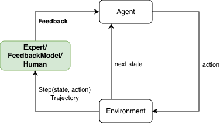

# Human Feedback RL
This is the repository for developing a software framework that aims to integrate multiple forms of feedback and uses them in **Learning Algorithms**.

## Dependencies

This project uses [`learning-from-human-preferences`](https://github.com/andrea02polimi/learning-from-human-preferences) as a library for the core RLHF pipeline (reward model training, preference collection, A2C agent).

### Installation

```bash
pip install -e .
```

This installs the package and all dependencies, including `learning-from-human-preferences` directly from GitHub.

Alternatively, using `requirements.txt`:

```bash
pip install -r requirements.txt
pip install -e .
```

> **Note:** `sumo_rl_ego` (the SUMO environment) is a separate private dependency and must be installed manually before running training or evaluation scripts.


*The development of the software framework is done as part of my Master Science thesis.*

In the first part of the thesis the objective is to implement a FeedbackModel (or Expert) that given a pair of state and action (i.e. one `Step`) or a `Trajectory` (a sequence of Steps) is able to return a `Feedback`.



There are four different types of `Feedback`: 
- `CorrectionFeedback`
- `DemonstrationFeedback`
- `RewardFeedback`
- `PreferenceFeedback`

For each type of `Feedback` we have an `Expert` which provides feedback per `Step` and per `Trajectory` (continuously), and these are all **abstract classes** to be implemented for a specific use case, for this thesis the objective is to test the framework in simulated autonomous driving (SUMO):
- `SpepCorrectionExpert`, `TrajectoryCorrectionExpert`
- `SpepDemonstrationExpert`, `TrajectoryDemonstrationExpert`
- `SpepRewardExpert`, `TrajectoryRewardExpert`
- `SpepPreferenceExpert`, `TrajectoryPreferenceExpert`